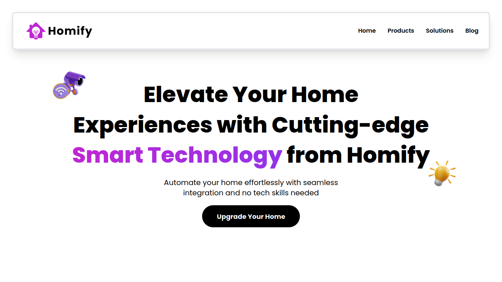

## Homify: Innovative Smart Home

Homify is a prototype smart home website, built with HTML, CSS, JavaScript, React and TailwindCSS.

## Project Screenshot(s)



## Installation and Setup Instructions

To see the project, follow these steps:

1. **Clone the Repository**

   Clone the repository to your local machine and navigate into the project directory:

   ```bash
   git clone https://github.com/raulmaulidhino-dev/homify.git
   cd homify
   ```

2. **Install Dependencies**

   Ensure you have [Node.js](https://nodejs.org/en) installed. Then, install the project dependencies by running:
   
   ```bash
   npm install
   ```

4. **Run the Development Server**

   Start the development server to see the project in action:
   
   ```bash
   npm run dev -- --open
   ```

   If it doesn't open automatically, you could open your browser and go to [`http://localhost:5173`](http://localhost:5173) to view the application.

- Alternatively, you also could see the smart home website here : [homify-web.vercel.app](https://homify-web.vercel.app)

## Reflection

This prototype project was made as a submission for [INSYFEST 2024 Web Development Competition](https://www.instagram.com/insyfest). Even though the project didn't make it to the final round, there were many things I learned during the development of this project with my colleague, [siddiqfathurahman](https://github.com/siddiqfathurahman). In the development process, I learned a lot about collaborating with other programmer(s) and time management. Apart from that, which is no less important, I also learned a lot about using Git in collaborating, maximizing React and Tailwind to improve website performance and UI/UX, and using npm packages that can support the development of the prototype project!

During the project development, I faced some problems like limited development time for the competition, which is only 2 weeks, means that this project is only a single page application. In addition, there are also problems when providing animation using the [AOS (Animate on Scroll)](https://michalsnik.github.io/aos/) package from npm. Sometimes, this animation package causes elements on the website to overflow, so it is not good for UI/UX. However, I'm able to overcome this by using enough animations and avoiding animation names that cause overflow such as `zoom-out` and `fade-left`. However, overall, this website is good in terms of appearance, responsiveness and typography.

In the future, my colleague and I will try to develop its main version to provide smart home products and services for people. I also hope this prototype project can inspire visitors to look for initial ideas for their suitable smart home website projects! ✨
